A puzzle bobble-like game for the Playdate Console.

I got the [Playdate](https://play.date) Console in my hands and thought it would be fun to learn to develop something for the device. It was also a chance for me to learn Lua since I've seen mentions of it for a long time but never had a reason to try to learn it.

### Game Contents
Not much, to be honest.

- It boots into the tutorial to give the controls to use. Dismiss into Level Select
- Level Select has a couple of test levels to choose from.
- You play the game by aiming an arm to shoot and destroy all bobbles. Aiming is done with the crank on the console.
- Completing the level gives you a score based on the number of shots fired. The lowest score is saved and displayed in level select.
- Options to restart the level, go back to level select and go to settings are found when pressing the "Menu" button on the device or simulator.
- You can delete your scores, view the tutorial again, and invert colors from the settings menu option

New levels should definitely be made, but manually setting up the file is cumbersome. Building a level editor is a stretch goal.

Continued additions and goals are listed further down.

### Current Progress

- Works on personal PlayDate console and simulator

Tutorial Screenshot

<!--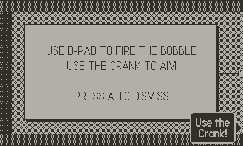-->
<!--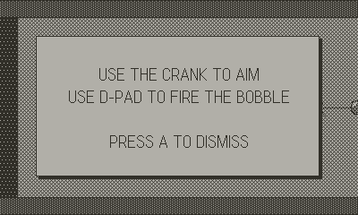-->
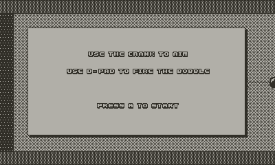

Level Select Screenshot 

<!--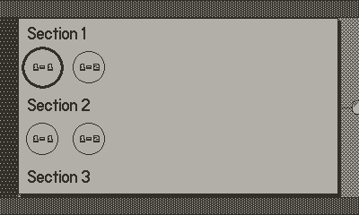-->
<!--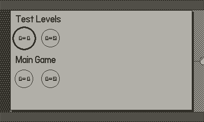-->
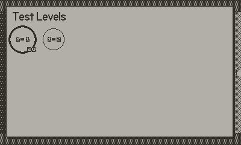

DEBUG Level Select Screenshot

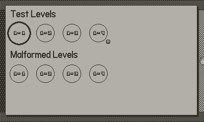

In-Game Screenshot
<!--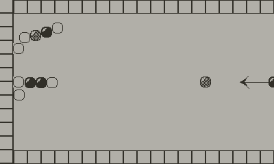-->
<!--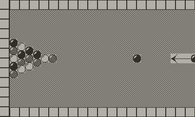-->
<!--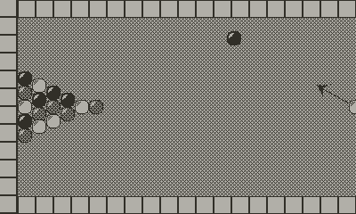-->
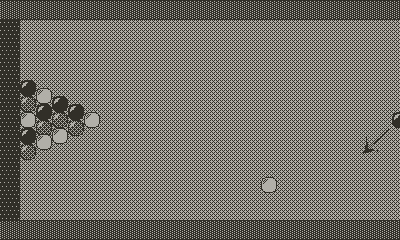

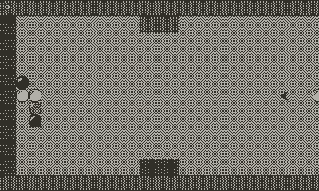

Level Complete Screenshot

<!--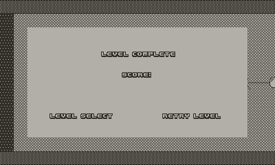-->
<!--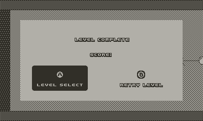-->
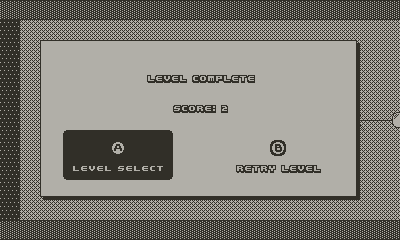

Setttings Screenshot

<!--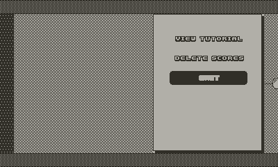-->
<!--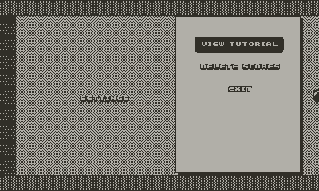-->
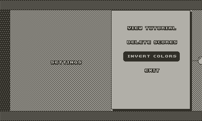

*(see TODO for note about SDK Assets)*

### Compile
- Set up PlayDate SDK - https://play.date/dev/
- From the root directory of the repo, run the build script
```
./build.sh [-b </path/to/build/dir>] [-f <playdatefile.pdx>]
```
- This build script creates the pdx file in the build directory and will also create a zip file for [sideloading through the PlayDate account page](https://play.date/account/sideload/)
- Drag pdx file into the simulator to start playing or to sideload to physical device

Fun fact: Running the pdx file in the simulator from a network share does NOT work. The errors don't make sense.

### TODO

#### [High Priority]
- Fix inconsistent floating bobble removal
  - Screenshot below of state of bobbles before all disappear
  - White bobble is shot at the pair of white bobbles in the middle of the chain
  - Everything on the side closer to the arrow should be the only thing to disappear
  - All Bobbles get removed and level gets completed earlier than it should

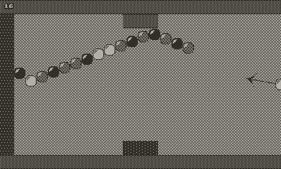

#### [Medium Priority]
- Levels
  - Update malformed_barriers.lvl
  - Build a level editor
    - PC based, not playdate based
    - Building by hand is far too time consuming when adding all neighbor pairs
  - Add more levels
    - Tanya has some ideas for designs of levels. She will be credited if/when she designs them

#### [Low Priority]
- Art
  - Sprite Updates
    - Barrier sprites update but its pretty boring still
    - Update the arrow sprite
    - Launch Images/Cards
    - Bobble2 is not very clear inverted
  - Replace SDK Example Assets
    - Make Font bigger
      - Totally fine looking on simulator but not very clear on hardware
      - https://play.date/caps/
  - Tutorial images will need to be made for illustrating controls. 
  - Proper card image
- Sounds
  - https://play.date/pulp/ For quick and easy (allegedly) sound creation
  - Needed assets
    - Sounds when hitting a barrier
    - Sounds when hitting a bobble
    - Sounds when popping bobbles
    - Song to play in the background
    - Menuing sounds
      - Move cursor/change level
      - Selecting an option/level
- Display current score and level on the menu image
  - https://sdk.play.date/1.10.0/Inside%20Playdate.html#f-setMenuImage
- Add pop-ups when you try to use menu items outside of their intended view
  - Example: "Unable to Delete Scores, please try again from Level Select" when in a level
- Moveable level barriers?
- Add Level Unlock and display requirements for locked levels
  - Check for malformed level unlocke requirement entries in menu.lvl


